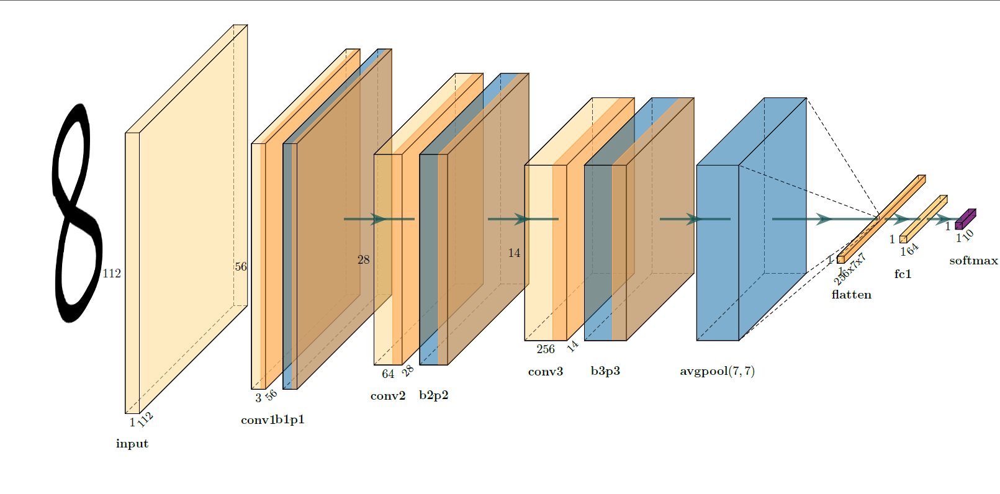
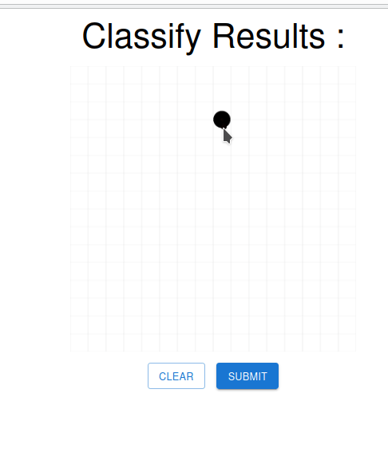

# React + Django + Pytorch Convolutional Neural Network Hand Writting Recongition Web App

- [React + Django + Pytorch Convolutional Neural Network Hand Writting Recongition Web App](#react--django--pytorch-convolutional-neural-network-hand-writting-recongition-web-app)
  - [A General Introduction](#a-general-introduction)
  - [How to Use](#how-to-use)
    - [Clone the repository](#clone-the-repository)
    - [Miniconda (Recommended)](#miniconda-recommended)
    - [NPM (Recommended)](#npm-recommended)
    - [Try the Demo](#try-the-demo)

## A General Introduction

**Attention: This web app is just a toy project which can not be used in production at all!**

This hand writting web app is based on simple convolutional neural network implemented in pytorch, which is trained on MNIST dataset reaching validation accuracy about 94% and validation loss (cross entropy) about 0.05. However I think it is overfitting and can not perform well on arbitrary hand writting image as you may try the web app by your own.



The app is implemented in Browser-Server Architecture. The server end is based on django rest frame work and the browser end is based on react js with axios to send asynchronous http request to commnicate with web server.

## How to Use

I recommend just take a glance at the app without deploy it.

### Clone the repository

``` bash
git clone https://github.com/AndrewLawrence80/dm_mnist.git
```

### Miniconda (Recommended)

1. Follow [Official tutorial](https://docs.conda.io/en/latest/miniconda.html) to install miniconda.
2. Create a virtual environment in conda.

   ``` bash
   conda create -n dm_mnist && conda activate dm_mnist
   ```

3. Install required wheels.

    ``` bash
    conda install pytorch torchvision torchaudio cpuonly -c pytorch
    ```

    ``` bash
    conda install jupyterlab autopep8 matplotlib pandas scipy
    ```

    ``` bash
    conda install django djangorestframework django-cors-headers -c conda-forge
    ```

4. Run the django server.

    ``` bash
    cd dm_mnist_backend && python manage.py migrate && python manage.py runserver
    ```

### NPM (Recommended)

1. **(Optional)** To manage different Node.JS verson, I recommend [NVM](https://github.com/nvm-sh/nvm).
2. **(Optional)** Install Node.JS LTS.

    ``` bash
    nvm install --lts
    ```

3. Run react app.

   ``` bash
   cd dm_mnist_frontend && npm install && npm start
   ```

### Try the Demo

Go to browser and address <http://localhost:3000>, you can try the web app.

